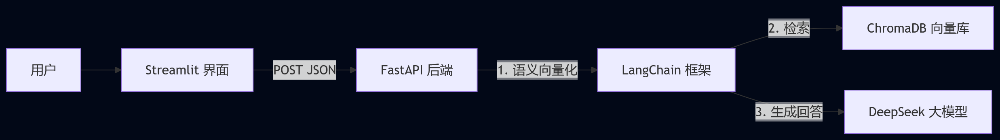

# AI 私有知识库助手
本项目基于 FastAPI + LangChain + ChromaDB 构建，实现了文档检索与智能问答功能，支持上传文件（PDF,docx等文件格式），知识库管理等功能，支持 Docker 一键部署。

# 架构：

# 演示：

### 快速部署
1. 配置 .env 文件
2. 启动服务: `docker-compose up -d`
3. 访问前端: `streamlit run frontend/app.py`
